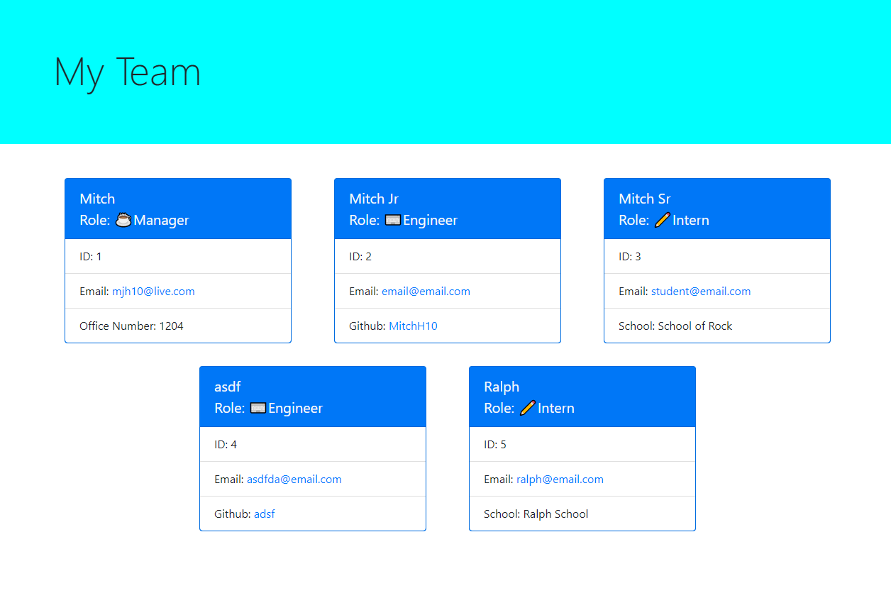

# Team Profile Generator 

## Description
This is a node application that creates an html file of a team of engineers and interns

## Video Showcase Link
[https://drive.google.com/file/d/1grGdXvlyHFxan6ltsfazaGUKcjOw7GSR/view](https://drive.google.com/file/d/1grGdXvlyHFxan6ltsfazaGUKcjOw7GSR/view)

## Table of Contents
- [Installation](#installation)
- [Usage](#usage)
- [License](#license)
- [Contributing](#contributing)
- [Tests](#tests)
- [Questions](#questions)

## Installation
To install download from Github and run an npm i in the command line

## Usage
Enter in each member of your team starting with the manager

## License
[http://www.wtfpl.net/about/](http://www.wtfpl.net/about/)  
~~~
      DO WHAT THE FUCK YOU WANT TO PUBLIC LICENSE 
      Version 2, December 2004 

Copyright (C) 2004 Sam Hocevar <sam@hocevar.net> 

Everyone is permitted to copy and distribute verbatim or modified 
copies of this license document, and changing it is allowed as long 
as the name is changed. 

DO WHAT THE FUCK YOU WANT TO PUBLIC LICENSE 
TERMS AND CONDITIONS FOR COPYING, DISTRIBUTION AND MODIFICATION 

0. You just DO WHAT THE FUCK YOU WANT TO.
~~~

## Contributing
To contribute reach out to me on Github or by email which can be found in the questions section.

## Tests
To test run npm test in the command line

## Questions
For any questions contact me on:  
Github: [https://github.com/MitchH10](github.com/MitchH10) or  
Email: [mjh10@live.com](mjh10@live.com)

## Link to repo
[https://github.com/MitchH10/Team-Profile-Generator](https://github.com/MitchH10/Team-Profile-Generator)